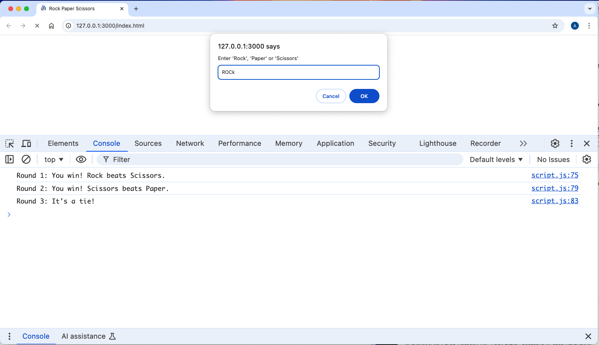

  <h1>Rock Paper Scissors</h1>

  A Console Based Game of Rock Paper Scissors ([live preview](https://ohgrmait.github.io/rock-paper-scissors/))

## About
This project shows a console based browser version of the grade school classic "Rock Paper Scissors".[^1]

[^1]: [This project](https://www.theodinproject.com/lessons/foundations-rock-paper-scissors) is from the [Foundations Course](https://www.theodinproject.com/paths/foundations/courses/foundations) in [The Odin Project](https://www.theodinproject.com/about).

## Showcase

  
  
This is a screenshot of the console.

  
  
This is a screen cast of the website.

## Technologies
- ***Git***
- ***CLI***
- ***CSS***
- ***HTML***
- ***GitHub***
- ***JavaScript***
- ***GitHub Pages***

## Self Reflections
- > I thoroughly enjoyed the process of learning JavaScript. I learned quite a lot of things: including variables and operators, different data types and conditionals, proper usage of the javascript developer tools, basics of functions, how to actually do problem-solving (the 3-stage process) and understanding errors.

## Acknowledgements
- Credit for README goes to [ritaly's README cheatsheet](https://github.com/ritaly/README-cheatsheet) and [ArjunSaili1's comment](https://github.com/TheOdinProject/curriculum/discussions/25472#discussioncomment-5889343).

## Contact and Support
- Please do not hesitate to contact me at ***ohgrmait_02945*** on discord for any project queries.