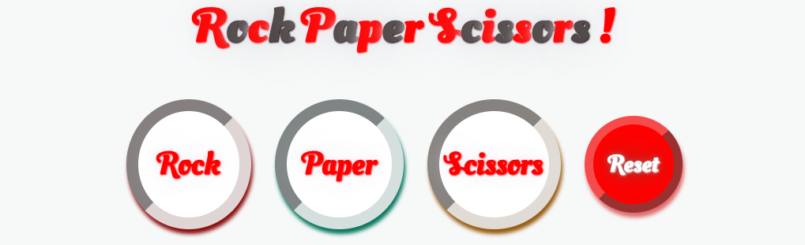
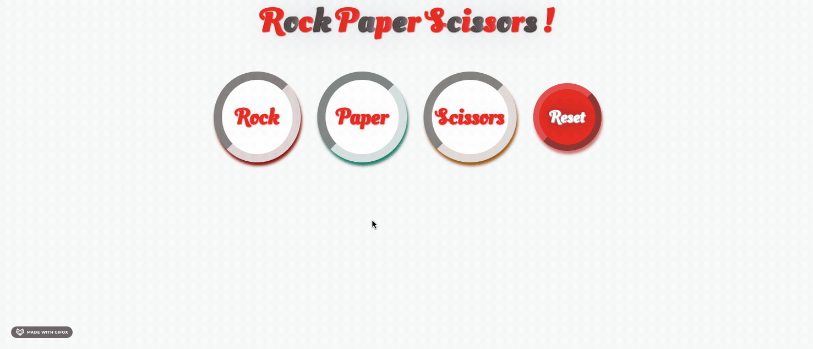

  <h1>Rock Paper Scissors</h1>

  A Game of Rock Paper Scissors ([live preview](https://ohgrmait.github.io/rock-paper-scissors/))

  

## About
This project shows a browser based implementation of the grade school classic "Rock Paper Scissors" with a graphical user interface.[^1]

[^1]: [This project](https://www.theodinproject.com/lessons/foundations-rock-paper-scissors) is from the [Foundations Course](https://www.theodinproject.com/paths/foundations/courses/foundations) in [The Odin Project](https://www.theodinproject.com/about).

## Showcase

  
  
This is a screenshot of the index page.

  
  
This is a screen cast of the Rock Paper Scissors website.

## Technologies
- ***Git***
- ***CLI***
- ***CSS***
- ***HTML***
- ***GitHub***
- ***JavaScript***
- ***GitHub Pages***

## Self Reflections
- > I thoroughly enjoyed the process of learning JavaScript. I learned quite a lot of things: including variables and operators, different data types and conditionals, proper usage of the javascript developer tools, basics of functions, how to actually do problem-solving (the 3-stage process) and understanding errors.

- > This is probably the only update needed. I added a GUI to the console based version of this game to make it look pretty. I also learned quite a bit about writing clean code and commenting, installing Node.js, arrays and loops, using event listeners to manipulate the DOM and finally how to make use of git branches.

## Acknowledgements
- Credit for the audio goes to [freesound_community](https://pixabay.com/users/freesound_community-46691455/) and [u_2fbuaev0zn](https://pixabay.com/users/u_2fbuaev0zn-30247713/) ([pixabay](https://pixabay.com/sound-effects/)).
- Credit for README goes to [ritaly's README cheatsheet](https://github.com/ritaly/README-cheatsheet) and [ArjunSaili1's comment](https://github.com/TheOdinProject/curriculum/discussions/25472#discussioncomment-5889343).

## Contact and Support
- Please do not hesitate to contact me at ***ohgrmait_02945*** on discord for any project queries.
- This project will no longer be worked upon and no further support will be provided for this project.[^2]

[^2]: The [TOP strategy guide](https://dev.to/theodinproject/learning-code-f56) makes it clear to [focus on the point of the assignment](https://dev.to/theodinproject/learning-code-f56#:~:text=Focus%20on%20the%20point%20of%20the%20assignment) and that [foundations isn't a strong portfolio generator](https://dev.to/theodinproject/learning-code-f56#:~:text=Foundations%20isn%E2%80%99t%20a%20strong%20portfolio%20generator), so I won't be wasting anymore time here.